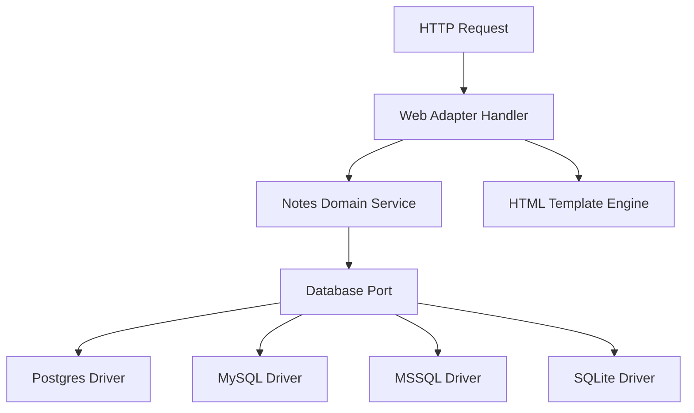

# Technical Architecture - tsqlnotes

This document outlines the software layers and database routing maps of `tsqlnotes`.

## Architecture Diagram

- **Web Adapter Handler:** Uses Go standard `http.ServeMux` to handle REST routes and static files.
- **Notes Domain Service:** Encapsulates business logic for managing notes metadata and storage structures.
- **HTML Template Engine:** Renders dynamic pages using standard Go `html/template` formats.
